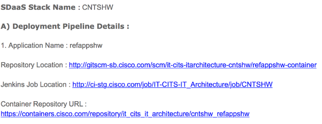
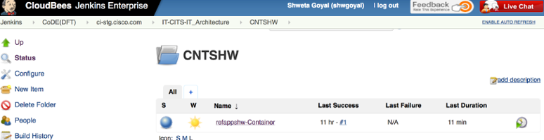
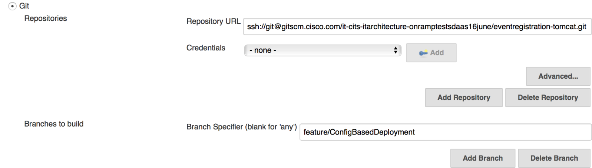
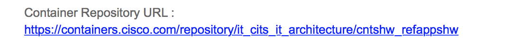
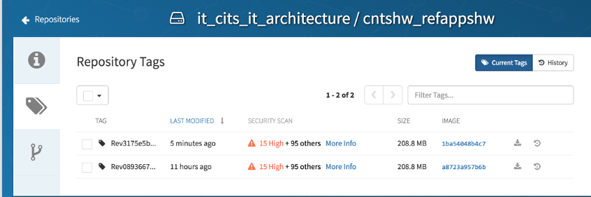
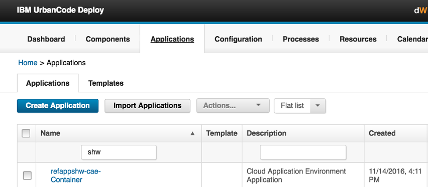
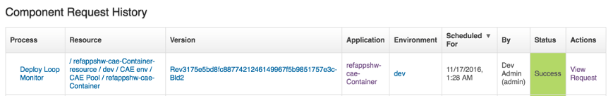
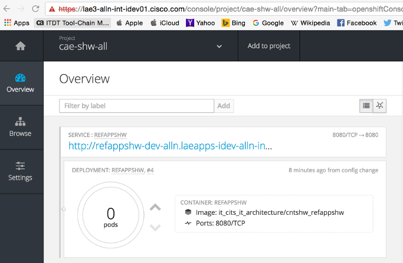

# Build and Deploy Application Container into CAE

**Objective**

At the end of this exercise you will have your application running as a Docker container inside CAE (OpenShift) platform.

**Prerequisites:**

1. <a href="https://cisco.jiveon.com/docs/DOC-1630729" target="_blank">Register Application</a>
2. <a href="https://cisco.jiveon.com/docs/DOC-1630730" target="_blank">Create CAE Projects</a>
3. <a href="https://cisco.jiveon.com/docs/DOC-1546539 " target="_blank">Setup SDaaS Pipeline</a>

**Step 1: Collect CI/CD pipeline details**
Have the information from your SDaaS setup confirmation email available, such as Stack Name, BitBucket URL, Container Repository Path, etc.

**Step 2: Check-in application code**
If you are trying to deploy the reference Application:
Checkout your branch.
Update your local repository.
Add the necessary Kubernates Configuration files and Dockerfile.
Commit and  push the update code to the Git repository.

**Step 3: Access the Jenkins Job**
1. Use your CEC credentials to login to the Jenkins Console to access the Jenkins Job per your SDaaS email confirmation:

**Step 4: Update repository branch**
 
Click on your project, then click on the Configure menu item on the left-hand side. Update the BitBucket branch where you have committed your code and save.

 

**Step 5: Build Job**
Now click on Build Job to initiate the build.
 

**Step 6: Verify image push to Container Hub**
Check the console output to check that the image has successfully built and pushed to the Container Hub.

------------------------------------------------
Successfully built 74fbb29c6773 + docker push containers.cisco.com/it_cits_it_architecture/cntshw_refappshw:Rev3175e5bd8fc8877421246149967f5b9851757e3c-Bld2 The push refers to a repository [containers.cisco.com/it_cits_it_architecture/cntshw_refappshw]
------------------------------------------------

**Step 7: Access image repository**

1. Login to Container Hub (ECH).
2. Access your image repository as per your SDaaS email confirmation:

**Step 8: Find latest build image**
Navigate to tag link to left hand side bar to find your latest built Image:

At this point, your application image is successfully built and tagged with the revision number generated by the Git commit.

**Step 9: Deploy** 

Login to uDeploy URL using your CEC id https://deploy.cisco.com
Search for your application under Applications Tab: 

Click on the Component to view the status of deployment

 

**Step 10: Access your CAE project**
 

Login to the datacenter-specific OpenShift console to access your CAE project; for example,  https://cae-np-rtp.cisco.com.
Click on the Overview tab to check if your container is running.

Browse to check deployments and event logs.
Subscribe to the mailer list cae-logs to view CLIP logs.
Successful deployment triggers automated Cert and CNAME registration baked into CAE event loop.