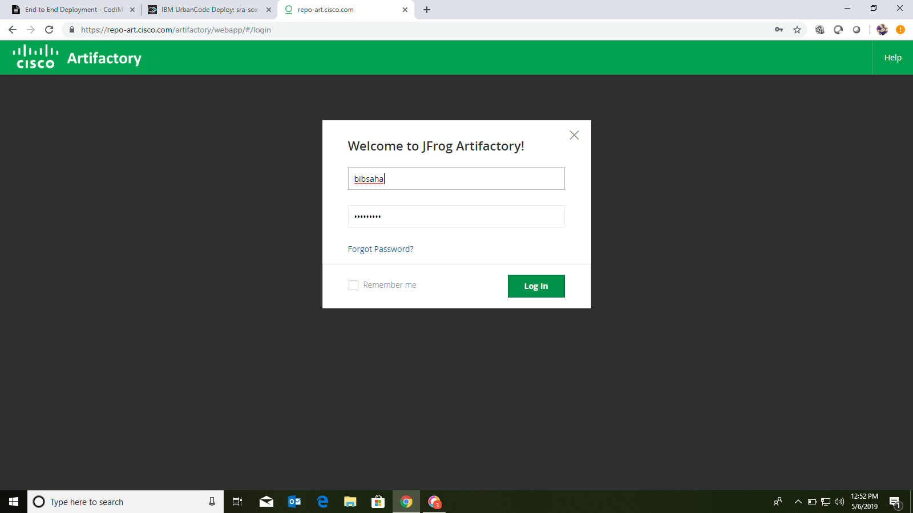
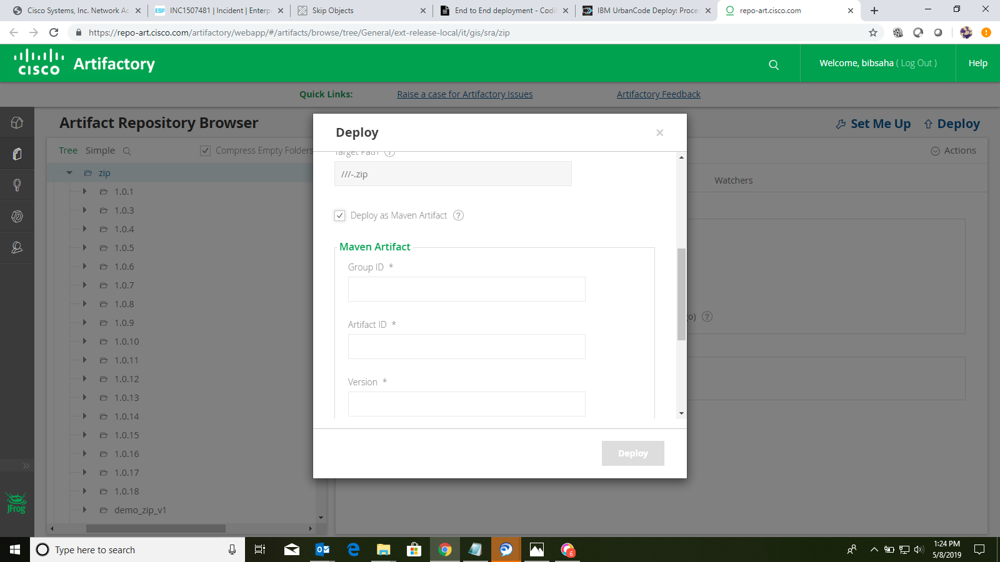

# End to End deployment 

- STEP 1: Login to Artifactory.
https://repo-art.cisco.com/artifactory/webapp/#/login

- STEP 2: Go to your artifactory Repository

- Step 3: Click on Deploy to deploy an artifact and the below window will pop up.

- Step 4: Select your artifact file to be deployed. Make sure that the file extention is the same as configured in uDeploy.

- Step 5: After the file is uploaded,click on "Deploy as Maven Artifact" give the version name and the proper group ID and Artifact ID.

- Step 6: Click on deploy to deploy the artifact. On successful deployment, you'll get this message.

- Step 7: Login to uDeploy and search for your component.
https://deploy.cisco.com:8443/

- Step 8: The deployment to dev environment is automated and happens when the file is deployed in artifactory. Click on "View Request" to see the execution and the logs.

- Step 9: The steps can be expanded to see the deployment steps and logs.

- Step 10: Go back to the component->Versions->Select your version->Configuration->Version Properties.

- Step 11: Add the User Stories/ Requirement_ID and click on save.

- Step 12: Create snapshot. To create a snapshot click on "Camera" icon.

- Step 13: Give a name to the snapshot and give a description and click on save.

- Step 14: Once snapshot is created, go snapshot->Component Versions and add version to your snapshot.

- Step 15: Now go to uRelease and click on "Pipeline View".
https://release.cisco.com:8443/

- Step 16: Search for your Application/Release.

- Step 17: Check if the latest snapshot is visible and then drag and drop the snapshot to stage to create a schedule deploy to stage environment.

- Step 18: Give the scheduled date and time and other fields as per requirement and click on save to create a deployment schedule.

- Step 19: Once the schedule is created, click on it.

- Step 20: Add the necssary gates and check whether the correct version is being deployed. Then click on "View Execution & Deployment Plan"

- Step 21: We need QA approval for stage deployment. Get the approval from the lead.

- Step 22: Once the approval has been given, click on "Start Deployment".

- Step 23: Click on the "start" option in the Deployment Tasks tab.

- Step 24: Once the deployment has started, you can track the progress and view the steps/logs by clicking on View/Edit for the deployment task.

- Step 25: Go to comments and click on "View Execution".

- Step 26: It will direct to uDeploy where you can  check the logs and the deployment steps.

- Step 27: Once the deployment to stage is successful, the snapshot can now be deployed to prod. Drag and drop the snapshot to prod and create a deployment schedule.

- Step 28: Click on "OK" to create a schedule.

- Step 29: Once the schedule is created check whether the correct version is selected and add the necessary gates.

- Step 30: Get the IT Manager's approval and click on "Start Deployment" and the "start" option in Deployment Tasks.

- Step 31: Click on View/Edit in Deployment.

- Step 32: Go to Comments and click on "View Execution to see the deployment process and the deployment steps"

- Step 33: It will direct you to uDeploy where you can see the deployment steps.

