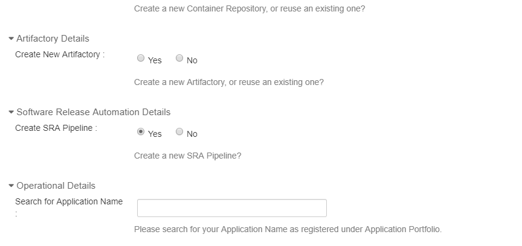
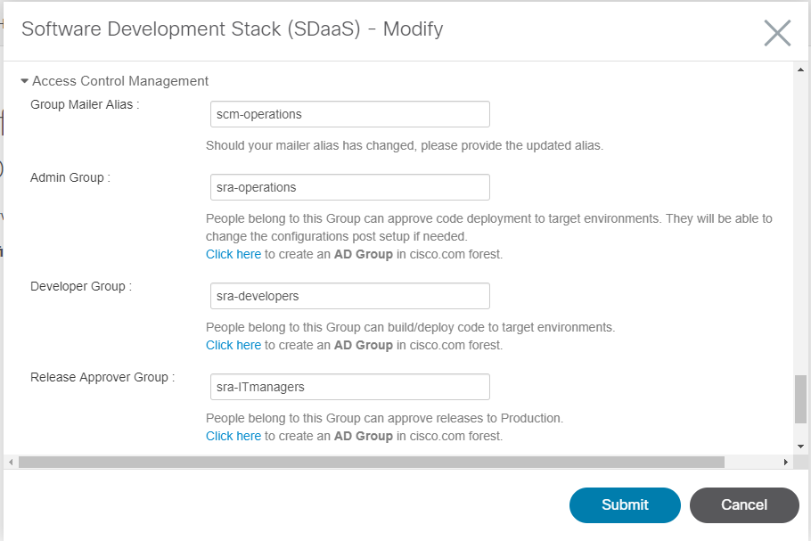
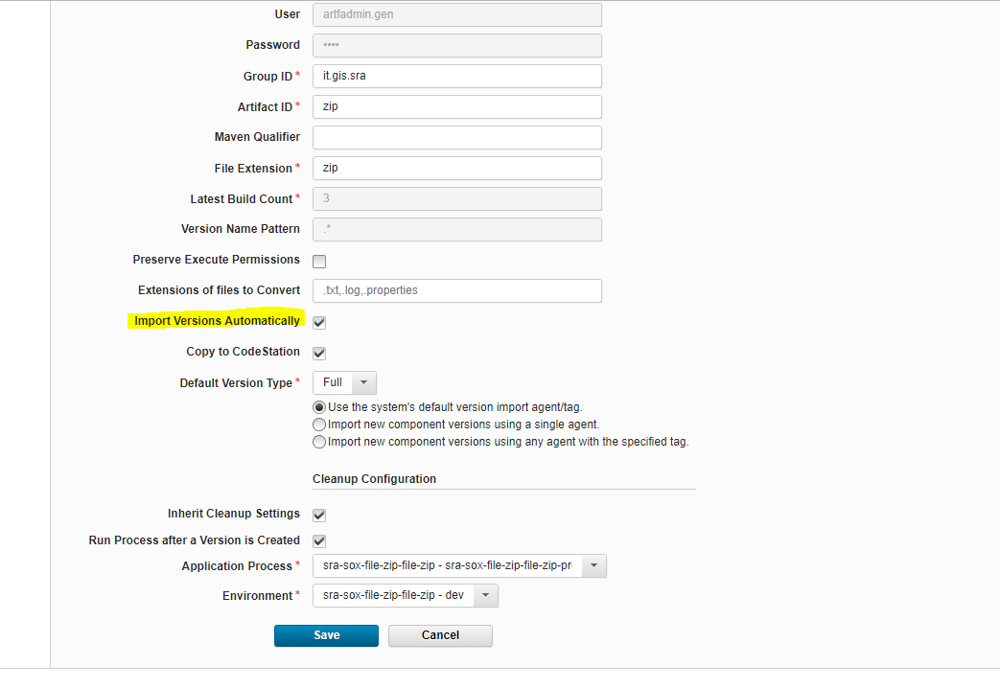
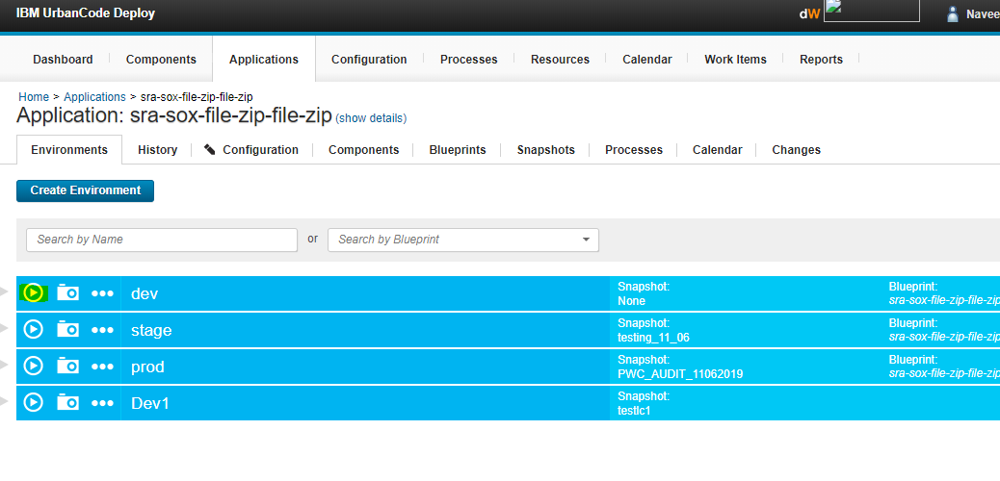
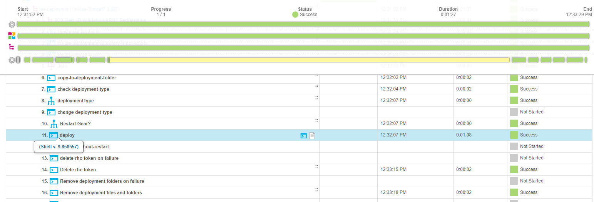
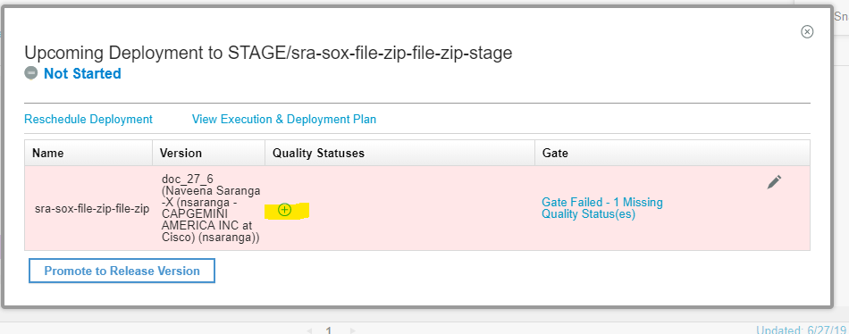
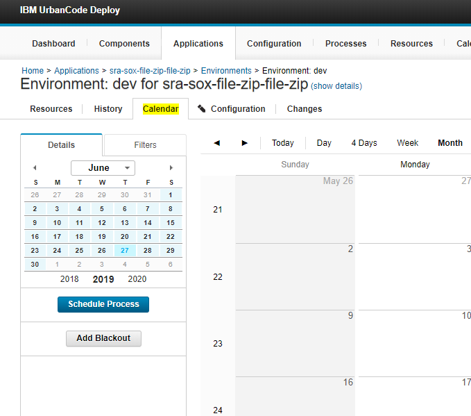
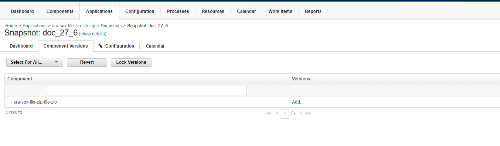
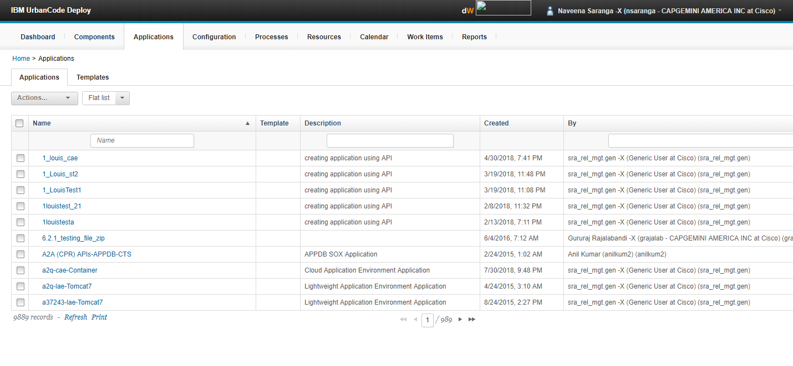
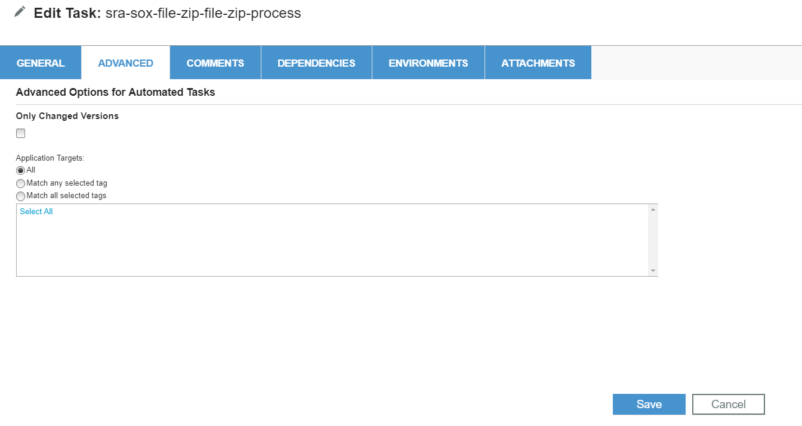

-   [Not able to login to uDeploy and not able to see my application uDeploy.](#1)
    
-   [I am not able to see my application in uDeploy.](#2)
    
-   [How to modify the AD group for our application as we have done segregation of duties.](#3)
    
-   [Are we suppose to submit separate stack creation requests for Dev, Stage, LT& Prod lifecycles of my Application?](#4)
    
-   [For one application, POM file was not published to artifactory and hence uDeploy could not download the exact file it was looking for.](#5)
    
-   [Build is successful, but version import is failing in uDeploy or Latest Versions are not getting imported in UDeploy; getting a notification as “Version import failed! Check the component’s configuration for more details”:](#6)
    
-   [uDeploy is able to pick the artifact from the artifactory but it is not starting the deployment](#7)
    
-   [How do I change the Artifact ID for my already provisioned application in uDeploy?](#8)
    
-   [How to deploy the code manually in uDeploy?](#9)
    
-   [How to check the deployment log?](#10)
    
-   [How to create a snapshot for the release?](#11)
    
-   [How to schedule the deployment in udeploy?](#12)
    
-   [I have created a snapshot in uDeploy still I am not able to see in uRelease?](#13)
    
-   [How to schedule the deployment in uRelease?](#14)
    
-   [In uRelease, Gate Status is Failed ,1 Missing Quality Status, CI Setup(Failed) is shown when trying to deploy](#15)
    
-   [I have schedule a deployment in uRelease but deployment has not started automatically?](#16)
    
-   [After snapshot creation, Start Deployment button was not available.](#17)
    
-   [QDeployment successful in uDeploy, but latest war file is not updated to tomcat Dev/Stage/Prod server](#18)
    
-   [How to deploy an old version in udeploy](#19)
    
-   [Version import is taking a lot of time, would be started 2 hours back and still in Executing status.](#20)
    
-   [Deletion of a sDaaS stack required due to inappropriate information provided](#21)
    
-   [Latest snapshot not getting updated quickly in uRelease](#22)
    
-   [Deployment is successful in uDeploy but the restart of CCIX application is not happening after deployment to dev/stage/lt/prod](#23)
    
-   [Submitted SdaaS request # , however it is still showing 0% complete.](#24)
    
-   [For one application, steps are not present in application process.](#25)
    
-   [User not able to see Application in pipeline view but stack is configured.](#26)
    
-   [Build is not proper as it is going to ext-release-local instead of ext-snapshot-local](#27)
    
-   [While trying to add Quality Status,user does not see the required quality status/gate in dropdown (Ex:CI Setup)](#28)
    
-   [While migrating a project from ANT to MAVEN, user will need to upload jars to Cisco Repository.](#29)
    
-   [How to restore the deployment task if accidentally deleted by a team member?](#30)
    
-   [How to add or apply the freeze to our applications.](#31)
    
-   [Failed to start Task: problem with doOnURl](#32)
    
-   [How can I deploy old snapshot in URelease?](#33)
    
-   [Udeploy Deployment fails with the Error: Deployment has failed in UDeploy with the error output “jbossews process failed to start” and “Error deploying local file. You can try to deploy manually with:ssh –t…”](#34)
    
-   [How to promote snapshot from Dev to Upper Environments?](#35)
    
-   [How to add a new environment in Udeploy and URelease?](#36)
    
-   [User not able to access uDeploy although he is a part of AD group specified while raising Sdaas stack. (AD Sync issue)](#37)
    
-   [While ordering for SdaaS stack the below error occurs for user](#38)
    
-   [How to set email notifications for any deployments/task/segments in uRelease?](#39)
    
-   [How to check whether the application is SOX or NON-SOX application?](#40)
    
-   [How to request membership for particular AD group?](#41)
    
-   [How to import version manually?](#42)
    
-   [How to create build for multistack application?](#44)
    
-   [What needs to be done when the deployment log shows version already installed?](#44)
    
-   [How to change Informatica SOX application to NON SOX application?](#45)
    
-   [Unable to approve Snapshot for PROD deployment?](#46)
    
-   [Passsed Validation Gate not added?](#47)
    
-   [Teradata Deployment Guide.](#48)
    
-   [uDeploy User Guide for OBIEE.](#49)
    
-   [Change/Setup environment variable in SFDC workflow in uDeploy](#50)
    
-   [What to do if no Sys ID gate is getting added in uRelease ?](#51)
    
-   [What to do if application is Non-SOX in uDeploy but SOX gate is added in uRelease OR vice versa](#52)
    
-   [Gate failed as waiting to join event/ Release ?](#53)
    
-   [Version not imported to udeploy for CAE applications](#54)
    
-   [Sox validation in uDeploy/uRelease through Rally .](#55)
    
-   [Snapshots failing at SOX validation step (Rally).](#56)
    
-   [Tags not imported in uDeploy for CAE application.](#57)
    
-   [If no tags are found in Quay(containers.cisco.com) even after the Jenkins build, then below snippet has to be added from the Jenkins end.](#58)
    
-   [How deploy a SOX application in PROD environment without joining a Release event(Non-CDRM) in URelease.](#59)

###  Not able to login to uDeploy and not able to see my application uDeploy.
Please contact your application admin and get access to Development AD group to get the access for your application	   
    
###  I am not able to see my application in uDeploy.
    
- Could you please check in your sDaaS you have selected Software Release Automation as Yes or No.
- If you selected as No please go to modify request from Estore and change it to  Yes  fill the required fields and submit the request.

        
###  How to modify the AD group for our application as we have done segrigation of duties.
    
Please go to modify request from Estore and select your application.

 It will auto populate the all the details please do necessary changes and submit the request.
  

###  Are we suppose to submit separate stack creation requests for Dev, Stage, LT& Prod lifecycles of my Application?]
    
Stack can be ordered for all the available lifecycles in a single order. If you have requested only Dev for now and if you want to request other life cycle you can use sDaaS modify request from Estore.

    

###  For  one application, POM file was not published to artifactory and hence uDeploy could not download the exact file it was looking for.
    
After including **.pom in Jenkins configuration include pattern and generating a new build, the required POM and tar.gz files are pushed to Artifactory & uDeploy is able to pull the file from artifactory successfully.

###  Build  is successful, but version import is failing in uDeploy or Latest Versions are not getting imported in UDeploy; getting a notification as “Version import failed! Check the component’s configuration for more details”:
    
Please check if "Import Versions Automatically" section has been checked in UDeploy's Component configuration of the specific application as it has to be checked for versions to import automatically into UDeploy, else the version has to be imported manually.

    
-  Please do verify the artifactory configuration in UDeploy’s Component Configuration i.e. Repository, Group ID, Artifact ID are configured correctly. These data should match with Artifactory’s POM.xml file. Please ensure POM.xml has sufficient and correct data in it to get the latest version in UDeploy and the deployment to go on successfully.
-  Also maven-metadata.xml has to be present in the artifactory's project folder.
-  In artifactory’s maven-metadata.xml, check if the latest version has mapped and the latest version folder is present in ascending order with the latest time stamp.
-  If any mismatch found in Udeploy and artifactory configuration, if you would want to change the configuration in udeploy then it can be modified through estore’s SDaaS Modify option
    

###  uDeploy is able to pick the artifact from the artifactory but it is not starting the deployment
    
-  “Run process after creating a new version “field is not selected in component configuration to run the process automatically for new version imports. Please enable this option.
    
	Home > Components > {application} > Configuration 

    
-   Please do verify the version number in both Artifactory and Udeploy’s Component Configuration
-   If the build is not uploaded in artifactory, then please do check the Jenkins configuration.
-   If the latest version is present in artifactory and not par with Udeploy, then check & correct the configuration as in the 6th FAQ (Latest Versions are not getting imported in U-Deploy; getting as “Version import failed! Check your component configuration”). If in case not able to resolve the issue, then please do raise a ticket to SRA-Tier1 in Service now under Release Automation service offering or contact  [sra-sdaas-support@cisco.com](mailto:sra-sdaas-support@cisco.com).
 
      
###   How  do I change the Artifact ID for my already provisioned application in uDeploy?
    
Go to estore <a href="http://estore.cisco.com/RequestCenter/servicecatalog/servicecatalog.do?route=offer&id=655" target="_blank">sDaas Modify</a> Request and order for the change of artifact Id .

    
###  How to deploy the code manually in uDeploy?
    
-  In uDeploy navigate to  Applications>  go to your application > in environment tab there will be environments > in that play button will be there please click on that.

    
However it is recommended to use uRelease to deploy to any non-Dev environment to not to violate SOX . 

    
###  How to check the deployment log?
    
-   In uDeploy navigate to Applications> go to your application > in environment tab there will be environments> click on the environment dropdown > click on view request there you will see the details log    

###  How to create a snapshot for the release?
    
-   In uDeploy navigate to Applications> go to your application > in environment tab there will be environments> click on camera button or go to snapshot tab and click on create  
 
    
###  How to schedule the deployment in udeploy?
    
-   In uDeploy navigate to Calendar > click on Schedule process > select the application, process, date and time
    
    
###  I have created a snapshot in uDeploy still I am not able to see in uRelease?
    
-  Once you create snapshot you need to wait for 10 min to integrate it with uRelease.
    
        
###  How to schedule the deployment in uRelease?
    
-   In uRelease navigate Deployments> Add New Scheduled Deployment > select the release  name ,  phase and versions with schedule date and time.
    
    
###  In  uRelease, Gate Status is Failed ,1 Missing Quality Status, CI Setup(Failed) is shown when trying to deploy
    
-   User needs to go to Execution and Deployment Plan and add the missing Gate (CI Setup) by clicking on the + symbol under Quality Status

    
###  I have schedule a deployment in uRelease but deployment has not started automatically?
    
-   Once you schedule a deployment please check you have started the deployment in that release or not please check is all gates are approved or passed or not.
-   If you are manually starting the deployment , please click on the next start button for the deployment task .

###  After snapshot creation, Start Deployment button was not available.
    
-   Please contact you application admin and subscribe for Application admin AD group from <a href="http://adam.cisco.com/" target="_blank">ADAM</a> page.
    
###  Deployment successful in uDeploy, but latest war file is not updated to tomcat Dev/Stage/Prod server
    
-   Please contact platform team .
-   LAE platform - [lae-operations@cisco.com](mailto:lae-operations@cisco.com)
-   AWS Team (CCIX) - [gs-pss-wipro@cisco.com](mailto:gs-pss-wipro@cisco.com)
    
###  How to deploy an old version in udeploy
    
-   Create a new snapshot by selecting the version which you wanted to deploy.
    
	Home > Applications > {your application} > Snapshots > Snapshot: {name} > Component Versions > add

###  Version import is taking a lot of  time,  would be started 2 hours back and still in Executing status.
    
-   Please raise a case in <a href="https://cisco.service-now.com/" target="_blank">Service Now</a> (Service Offering: Release Automation)   

 
    
###  Deletion of a sDaaS stack required due to inappropriate information provided
    
-   Please go to <a href="http://estore.cisco.com/" target="_blank">eStore</a> search with SDaaS and there is delete request for deleting the SDaaS stack

    
###  Latest snapshot not getting updated quickly in uRelease
    
-   There is a 15 minute cycle for pulling the latest snapshots from uDeploy. As there are many snapshots to be pulled it will take some time.
        
###  Deployment is successful in uDeploy but the restart of CCIX application is not happening after deployment to dev/stage/lt/prod
    
-   Please contact AWS Team [gs-pss-wipro@cisco.com](mailto:gs-pss-wipro@cisco.com)
    
###  Submitted SdaaS request  # ,  however it is still showing 0% complete.
    
-   Please contact PaaS  Team [citeis-paas-support@cisco.com](mailto:citeis-paas-support@cisco.com)
    
    
###   For  one application, steps are not present in application process.
    
-   Please raise a case in <a href="https://cisco.service-now.com/" target="_blank">Service Now</a> (Service Offering: Release Automation)
    
    
###  User not able to see Application in pipeline view but stack is configured.
    
-   Application admin should check if the setup is fine .If everything looks good with the setup, check QA AD Group and ask user to request membership for that AD Group from <a href="http://adam.cisco.com/" target="_blank">ADAM</a>
   
    
###  Build is not proper as it is going to ext-release-local instead of ext-snapshot-local
    
There can be two possibilities:
    
1.  Check whether the Configuration settings in Jenkins are as below. If not, Request application  team to change the path in Jenkins build.

    
2.  Check the version number in pom.xml file. It has to be in XXX-SNAPSHOT format.
    
Ex: 1.0.0-SNAPSHOT 

    
###  While  trying to add Quality Status,user does not see the required quality status/gate in dropdown (Ex:CI Setup)
    

    
-   User needs to check with Application admin as he needs to subscribe himself for the application admin ad group from [ADAM](http://adam.cisco.com/).
       
###  While  migrating a project from ANT to MAVEN, user will need to upload jars to Cisco Repository.
    
-   You can raise an estore sdaas  request[In estore search for Sdaas] with target environment as ‘Artifactory’ and Artifactory Access type as ‘Public’.
-   Once raised, a confirmation mail will be received with the artifactory URL Details for uploading their files.

    
###  How to restore the deployment task if accidentally deleted by a team member?
    
When user is trying to start deployment for the application in stage, getting error “This deployment plan does not contain any runnable tasks” User not able to see pre-deployment tasks being populated and unable to create automated task

    
User deleted the deployment task by  mistake,  application admins will be able to add the task
    
1.  back to resolve the issue by clicking on Add Automated task and selecting taskà Save
    
CASE 1: If deployment task exista and only autoated task is missing, please follow below step
    
Step 1: add the automated task

CASE 2: If Deployment task it self is deleted
    
Step1: click on Create segment please follow below step 
  
Step 2: fill the details as below 
    
Step 3: add the atuomated task

   
###  How to add or apply the freeze to our applications.
    
-   For adding or applying Freeze, you can add it in Blackout plan for your applications in uDeploy (uDeploy > Applications > Environments > Calendar) 
     
    
###  Failed to start Task: problem with doOnURl
    
-   As seen in below screen shot you will notice “Failed to start Task: problem with doOnURl”

    
-   This is due to version wont be there in snapshot. We need to add in snapshot. Click on snapshot à component version add.

    

    
###  How can I deploy old snapshot in URelease?
    
-   In the pipeline view, drag and drop the latest release to the target environment as you normally would.
-   In the environment, click on the time stamp for the scheduled release.
-   In the Upcoming Deployment popup, click on link for “View Execution and Deployment Plan.”
-   When the Deployment Plan screen appears, click on the Contents & Notifications tab.
-   In Deployment Contents, click the edit option at the right side of the entry for the deployment.
-   This will make the version a drop-down. Pick the older snapshot you want and save the changes.
    
    
###  Udeploy Deployment fails with the Error: Deployment has failed in UDeploy with the error output “jbossews process failed to start” and “Error deploying local file. You can try to deploy manually with:ssh –t..”

-   Please do contact LAE team - "[lae-operations@cisco.com](mailto:lae-operations@cisco.com)".
    
###  How to promote snapshot from Dev to Upper Environments?
    
-   Login to <a href="https://release.cisco.com:8443/" target="_blank">IBM UrbanCode Release</a> using your CEC credentials  

    
-   Click on the Pipeline View and select the application from the drop down list that you wish to deploy
-   In the NEWEST section users will see the latest snapshot being pulled into uRelease
-   Drag and drop the snapshot to the environment to which the next deployment has to go as in the below screenshot.

    
    
-   After the drag and drop, you have to schedule as in below screenshot.
    

    
-   Check "Start Automatically" to start the deployment automatically
-   Users can then trigger deployment from Deployment Plan to trigger it manually.
-   Click on the scheduled time and then the "View Execution & Deployment Plan" link to proceed with manual deployment.
-   Note: Please ensure there is no Gates/Approval pending to proceed further.
-   Click on the Start Deployment button to trigger the deployment manually.
-   Once all approvals are in place, from the Deployment Tasks section please click on the Start button and you can then monitor the progress of the application deployment from here or in uDeploy.
    
###  How to add a new environment in Udeploy and URelease?
    
-   Please use <a href="http://estore.cisco.com/RequestCenter/servicecatalog/servicecatalog.do?route=offer&id=655" target="_blank">sDaas Modify</a> in Estore and request in "Life Cycle Details" section for the environment which you want to be added.
    
###  User not able to access uDeploy although he is a part of AD group specified while raising Sdaas stack. (AD Sync issue)
    

    
    -   Need to update the user in uDeploy. Please raise a case with sra-tier1
    
###   While ordering for SdaaS stack the below error occurs for user

    
   
-   please use other than ‘ / ‘ and ‘ _ ‘ as they are not allowed in directory path, suggested by CITEIS PaaS Support Team
    
    
###   How to set email notifications for any deployments/task/segments in uRelease?
    
-   Under Notification Configuration you can create notifications for Start/Fail/Finish of Deployment/Task/Segment
   
    

    
-   Mail received will be of below format:

    
###  How to check whether the application is SOX or NON-SOX application?
-   Login to <a href="https://deploy.cisco.com:8443/" target="_blank">IBM UrbanCode Deploy</a>

-   Open your application; Navigate to application -> configuration. Click on application properties on the left.
-   If SOX value is false then application is NON sox application; if it’s true then the application is SOX application.

    
###  How to request membership for particular AD group?
 
-   login to <a href="http://adam.cisco.com/" target="_blank">ADAM</a>'s Account.
-   Goto Group Search, search for AD Group name which you have or our team has shared with you.

    
-   Then please click on request membership and provide justification.
-   Notify the owners and once the owners approve it, you would be part of that group.
    
###  How to import version manually?
    
-   login to <a href="https://deploy.cisco.com:8443/" target="_blank">IBM UrbanCode Deploy</a>.
-   Navigate to the application and click on the application name
-   There will be sub-tabs for that application such as Environment, History, Components etc, select the component tab and click on the component name
-   Navigate to versions tab
-   Click on import version mamually, click on save without select anything, it will import the latest version from artifactory.

    
###  How to create build for multistack application?
    
Refer to this [document](https://apps.na.collabserv.com/wikis/home/wiki/W4ae5df2fa9b8_419b_8361_46b3d6f6ebda/page/Software%20Development%20Stack%20%28SDaaS%29%20for%20Advanced%20Deployment%20%28LAE%29) in the ICX page for step by step instructions.
    
    
###  What needs to be done when the deployment log shows version already installed?
      
-   This indicates that the snapshot was created with already deployed version.
-   Schedule a new deployment
-   Double click on the Process “deploy” for the application
    

    
-   Wait for the Application Name to be Populated
    

    
-   Navigate to the Advanced Tab. Uncheck “Only Changed Versions” and Click on Save

    
-   Trigger the deployment manually or wait for it to start automatically.
    
###  How to change Informatica SOX application to NON SOX application?
    
Please raise a case with proper justification if there is a request to change any Teradata/Informatica applications from Non-SOX to SOX or vice versa as that requires configuration changes in uRelease as well which only SRA team can perform.

    
###  Unable to approve Snapshot for PROD deployment?
    
User should have sufficent privileges to approve for prod and should be part of the IT Manager ADAM group.
    
###  Passsed Validation Gate not added?
    
Following criteria should be met for the “Passed Validation” gate to be added dynamically:    
    -   Unique Approvers for Prod and Non-Prod
    -   Snapshot should be deployed to any one of the Non-Prod env that has approvals set.
    -   There should be one schedule/application/snapshot and the snapshot should be approved
    -   Any deployments should take place via uRelease
    -   Check if there are any duplicate schedules
    
###  Teradata Deployment Guide.
    
Please follow the [Teradata Deployment Guide](https://apps.na.collabserv.com/wikis/home/wiki/W3213ca86d305_4c1a_b111_89b8dadb845e/page/Teradata%20Deployment%20Guide) in the ICX page. 

###  uDeploy User Guide for OBIEE.
    
Please follow the [SRA uDeploy User Guide For OBIEE](https://apps.na.collabserv.com/wikis/home/wiki/Wbfdcbc9fda6c_43c5_a5fe_cf0bd3fce99a/page/SRA%20uDeploy%20User%20Guide%20For%20OBIEE) in the ICX page. 
    
###  Change/Setup environment variable in SFDC workflow in uDeploy
    
Go to the particular environment in application, make required changes in Environment configuration -> Environment properties
    
###  What to do if no Sys ID gate is getting added in uRelease ?
    
Please contact sra-sdaas-support@cisco.com to add the sys Id in uRelease.
    
###  What to do if application is Non-SOX in uDeploy but SOX gate is added in uRelease OR vice versa ?
    
Please reach out to SRA ops team to make it non-sox in uRelease or vice-versa.
    
    
###  Gate failed as waiting to join event/ Release ?
    
Go to View Execution and Deployment > Overview> Join event
    
###  Version not imported to udeploy for CAE applications
    
Please delete tags from container.cisco.com . Version is not imported in uDeploy if the tags are more than 50 in the container.
    
###  Sox validation in uDeploy/uRelease through Rally .
    
Refer SOX Validation in uDeploy/uRelease through Rally [document](https://apps.na.collabserv.com/wikis/home/wiki/W52d8c1c91d6a_41eb_a30f_021c10f3ec18/page/SOX%20Validation%20in%20uDeployuRelease%20through%20Rally%C2%A0) in the ICX page.
    
###  Snapshots failing at SOX validation step (Rally).
    
Refer this [document](https://apps.na.collabserv.com/wikis/home/wiki/W8a035710e5dd_4861_adc6_1db5506a4cab/page/uDeploy%20and%20uRelease%20FAQs?lang=en-us&section=jive_content_id_SNAPSHOTS_are_failing_inat_UDeployARRT_setup) in the ICX page.
    
###  Tags not imported in uDeploy for CAE application.
    
Please validate the below points :
    
1.Check the repo path is correct.
    
2.Verify if the tag is available in that path.
    
3.If still unable to import, goto containers.cisco.com and check the lists of tags. In case if the number of tags are more than 150, then user need to delete the unwanted among them.
    
(For the deletion user need to involve ECM team also). Then only the tags will get import to the udeploy.
    
###  If no tags are found in Quay(containers.cisco.com) even after the Jenkins build, then below snippet has to be added from the Jenkins end.
    
No action from uDeploy end . Involve Jenkins Team(ci-dft@cisco.com) for help .
    
    stage("Docker push") {
            steps {
            sh 'docker push containers.cisco.com/it_cits_connected_software/iqe-platform-automation_iqe:Rev$GIT_COMMIT-Bld$BUILD_ID'
            }
            }
    
###  How deploy a SOX application in PROD environment without joining a Release event(Non-CDRM) in URelease.
    
For a sox application – who want to perform deployment which isn’t part of any Release event or doesn’t join a Release event, below are the steps to follow:-
    
-   Post you deploy the snapshot in stage environment through URelease and triggered a Prod Schedule deployment.

    
-   	Approve schedule deployment of PROD with the manger.
-   	After approval, if user not joins any Release Event. Bleow are the gates added.
<!--  -->

	
-   	Please add the quality status as “**Non-CDRM**” as the deployment is not part of any Release Event
-   	And the deployment would proceed with the sox validations and sox gates would be added based on the sox test case validations

