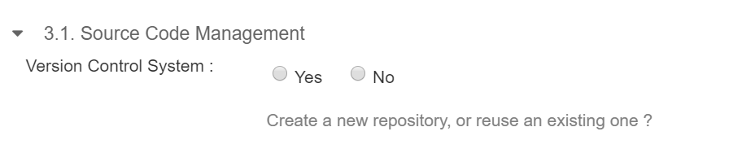

**Software Development Stack (SDaaS) request process**

**Objective**  
To create SDaaS stack to use the cisco builds on your application source code.

**Step 1: Login to interface**  
Go to  <a href="http://estore.cisco.com/" target="_blank">eStore</a> and fill in your credentials

<!--  -->

**Step 2: Search SDaaS Service**  
Navigate to SDaaS by searching in the search bar or clicking through the categories

Search SDaaS in the Search Catalog.

<!--  -->

**Step 3: Order Software Development Stack (SDaaS)**

_**Step 3.1: Start stack creation**_  
Click on Software Development Stack (SDaaS) - Create

<!--  -->

_**Step 3.2: Order and define software stack**_  
Click the order button to begin the ordering process. Fill in the Order form. Refer to help text for more help. Provide Stack Name, Organization & Functional Group details.

<!--  -->

_**Step 3.3: Specify targeted runtime**_  
Select Target Environment as per requirement and fill the the mandatory data based on this selection.

<!--  -->

_**Step 3.4: Manage source code**_

If you require a new Source Code Management setup, select Version Control System as Yes.  
Select the required Version control System (SVN/Bitbucket). The repository Suffix and path will get automatically populated. You can modify the repository suffix as required to change the repository URL.

<!--  -->

If you have an existing Source Code Repository & you want to reuse that, you can select the Version Control System as No and provide your existing repository path URL.

_**Step 3.5: Setup Continuous Integration**_  
Select Yes or No for Continuous Integration to create a new CI job based on your need.

<!--  -->

You can include a Sub Directory Path if needed or can leave it blank.

Select the required Job Type (Ant or Maven)

_**Step 3.6: Configure Repository**_

Based on the previous selections, configure the required Repository.

_**Step 3.7: Select Application Lifecycle as Other.**_

<!--  -->

_**Step 3.8: Confirm Details**_  
Once these details are entered use Confirm Details to transfer this to table as shown below. In a single order you can configure more than one Application or more than one Technology.

<!--  -->

_**Step 3.9: Define Access Control Details**_

Please review the various roles & click on Submit button to proceed. These groups can also be updated later as part of Modify service.

<!--  -->

You will be redirected to the following page indicating that your order has been submitted. Order will be submitted for processing with a confirmation number. Use this number for future correspondence with support teams if needed. If you have any questions regarding to your SDaaS request, please reach out to  [itdt-sdaas-support@cisco.com](mailto:itdt-sdaas-support@cisco.com)

<!--  -->

_**Step 3.10: Wait for completion of stack creation**_

Stack setup typically take 15-20 minutes to complete. Once setup is complete request & mailer alias mentioned in order form will get a successful email with instructions on what next.

The email that you receive will have the following details:

1.  Svn/Bitbucket path where your committed code will reside
2.  Jenkins job location where you can build the code present in your version control system
3.  Container Repository URL where the image of code built in Jenkins can be found

