# Multistack LAE process

This Document is for LAE platform Users to understand LAE multiple life cycles provision & deployment capabilities and it’s business benefits. Also explains about provisioning multiple custom life cycles, procuring SDaaS pipeline for multiple primary deploy life cycles and end-to-end SdaaS configuration. 

### **What are custom life cycles in LAE platform and where do we use them?**

LAE platforms offers custom life cycles in addition to standard dev, stage, lt and prod life cycles. These custom life cycles are available to provision on both non-production and production environments. Some of the use cases of custom life cycles,
- You can provision custom life cycles to achieve parallel development environments for a single application (Typical scenario is ERMO test cycles).
- You can provision custom life cycles in PROD and use them for near zero down time deployments. Here are more details about it,

  http://wikicentral.cisco.com/display/LAEDOCS/Blue+Green+Deployments

- You can provision custom life cycles in PROD and use them for A/B stack (Blue Green Deployments), where multiple concurrent application code versions can be active for your business users. More details are given in link,

  http://wikicentral.cisco.com/display/LAEDOCS/Blue+Green+Deployments
  
**Note:** For CCIX to LAE migrating applications, ERMO test JVMs can be provisioned as custom life cycles of primary application.

**Example:** CCIX Primary application	=    Sample (dev, stage, lt & prod)
     ERMO Test Cycles 	= Ys1Sam (dev, stage & lt), Ys2Sam (dev, stage & lt)..Etc.
	     LAE	Primary application	= Sample dev, stage, lt & prod, and ys1d, ys1s, ys1l and ys2d, ys2s, ys2l…….etc   
					=> Here test cycles can be added as custom life cycles.

**What are SDaaS multiple primary deployment life cycles and what is the benefit?**

In current SDaaS pipeline for an application you cannot choose more than one life cycle as primary for deployments.  So if you want to manage parallel development, build and release of a single application is not possible. 

With this new feature you can choose multiple primary deployment life cycles, where you can have both dev & stage as primary, or dev1, ys1d & ys2d as primary deployment life cycles and rest of them can be configured as release life cycles. For each primary deployment life you will get a separate Jenkins job, so you can configure individual repository branches to corresponding Jenkin Jobs.

Whereas in Urelease all primary deployment life cycles and release life cycles will show-up in a single pipeline, so you can easily drag & drop snapshot from any of primary life cycles to other release life cycles.

 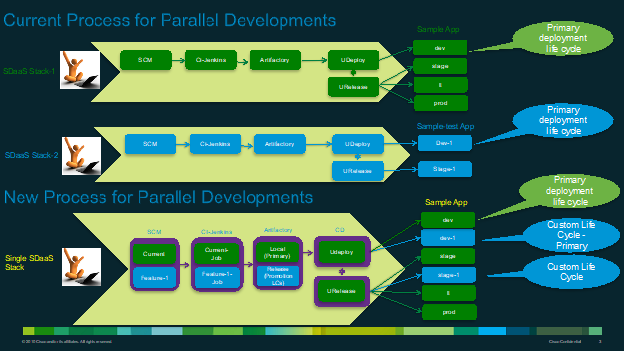

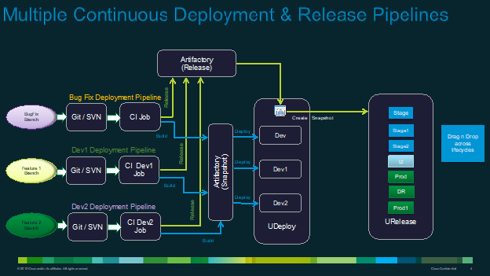

 
With this release Continuous Delivery provides more developer friendly capabilities, few are given below.

•	**Multiple Primary Development Lifecycles:** Teams and developers can work on concurrent development branches, and independently deploy to their DEV lifecycle.

•	**Differentiated Development & Release Pipelines:** Higher quality can now be ensured with a creation of a separate deployment pipeline for releases. This gives the developers the ability to continue to work on their independent modules/versions, and only promote integration ready code to the release branch. Dev-Integration, Staging, and Prod-Staging level testing are incrementally facilitated using the release pipeline.

**Note:** For CCIX to LAE migrating Applications, ERMO test JVMs does not require multiple SDaaS pipelines for each test cycle (ys1*, ys2*…). Now with this capability developer can add multiple ERMO test cycles in to Primary app SDaaS pipeline and manage easily. Which helps in reducing number of builds and same test cycle snapshot can be promoted to Primary life cycle during release (in URelease/Udeploy).

## **How do I provision custom life cycles in LAE?**

For New Applications:

•	Go to estore.cisco.com and search for LAE services
•	Procure vLAE  
•	Next go to LAE application create service and choose non-prod & prod, under life cycle section choose custom and give custom life cycle name (allowed max 4 characters). Add to cart for each custom life cycle and submit finally.

For CCIX to LAE migrating Applications:

•	Go to Migration tool and provision your primary application (dev, stg, lt and prod)
•	Next in estore go to LAE application create service and choose your primary application vLAE (non-prod or prod)
•	Under life cycle drop-down section choose custom and provide custom life cycle name (ex: ys1d, ys1s, ys1l, ys2d, ys2s, ys2l…etc). You can choose virtual name as ys1<app>-dev-.cloudapps.cisco.com
•	Add to cart for each custom life cycle and submit.
    
## **How do I request SDaaS with multiple primary deployment life cycles?**

**Note:** Before you proceed SDaaS stack creation, your LAE application has to be provisioned (with all custom life cycles)

New SdaaS Users:

•	In Estore.cisco.com, search SDaaS services and choose New SdaaS stack creation
•	Give new stack name, choose LAE App name and add each life cycle
•	Under SRA pipeline section, Choose LAE Multi Pipeline Template
•	 For each life cycle addition, choose yes for primary deployment life cycle.
•	After adding all life cycles of application to cart, proceed with request submission.

## Existing SdaaS Users:

•	For existing Users, You can convert stack from single to multiple by SDaaS Modify service in Estore.
•	In Estore.cisco.com, search SDaaS services and choose Modify SdaaS stack. 
•	Select existing stack name planned to convert, next choose LAE App name and under SRA Pipeline section you choose LAE Multi Pipeline Template.
•	Under pipeline cart section, for each existing life cycle, choose yes for primary deployment life cycle, where you can select more than one.

**Note:** To add more custom life cycles of same application to SDaaS stack, go to SDaaS stack creation service in Estore and select No for new stack, select existing stack.

•	Choose existing LAE App and further down add addition custom life cycles to cart.
•	Make sure to choose SRA pipeline as LAE multi pipeline sdaas template.

**Example SDaaS Stack creation in EStore:**

1.	Add all required lifecycle details through estore -> Create LAE

 
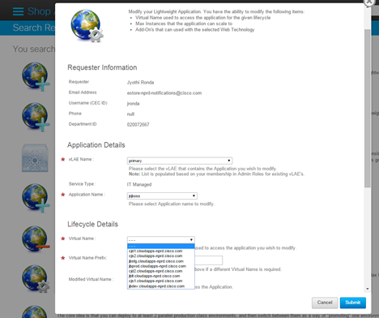

2.	Create sdaas for all the lifecycles through estore and select the primary lifecycles during creation.

**Eg:** Below snapshot has 3 primary lifecycles dev, cjd1,cjd2

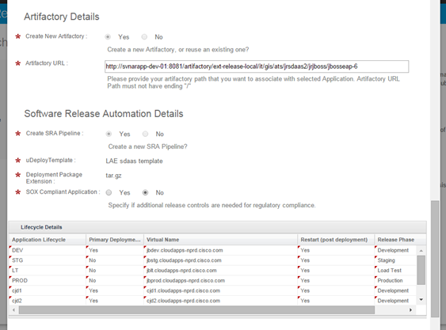

 

**SDaaS Stack Configuration for Multiple Primary Deployment Life Cycles:**

**Note:** There are few changes required from SDaaS configuration & deployment process perspective to utilize multiple deployment life cycle feature. Which are given below,

1.	**Repository:** Create separate branches for each primary lifecycle.

2.	**Pom.xml:** Update the version in pom.xml as <version>x.x.x-{lifecycle}-SNAPSHOT</verison>

3.	**Jenkins:** Update the branch path/name for the select life cycle

4.	**Snapshot:**
-	Run the release staging from Jenkins
-	Create snapshot through UDeploy and select the latest version

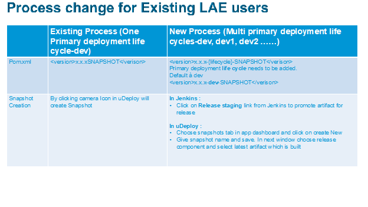

 
**Example:** 
LAE app has been provisioned with multiple custom life cycles as given below.

- **Stack Name** - jrsdaas2
- **Application** - jrjboss
- **Version**  - Jbosseap-6
- **Lifecycles** - Dev, Stg, cjd1,cjs1, cjd2, cjs2, Lt, Prod
- **Git Repository** - http://gitscm-sb.cisco.com/scm/it-gis-ats-jrsdaas2/jrjboss-jbosseap6
- **Jenkins Job** - http://ci-stg.cisco.com/job/IT-GIS-ATS/job/jrsdaas2
- **Artifactory Repository** - 
http://svnarapp-dev-01:8081/artifactory/ext-release-local/it/gis/ats/jrsdaas2/jrjboss/jbosseap-6

- **UD & UR Application Name** - jrjboss-lae-Jbosseap-6

 
- **Git - Create Branches**

     http://gitscm-sb.cisco.com/projects/IT-GIS-ATS-JRSDAAS2/repos/jrjboss-jbosseap6/browse?at=refs%2Fheads%2Fcjd1

    http://gitscm-sb.cisco.com/projects/IT-GIS-ATS-JRSDAAS2/repos/jrjboss-jbosseap6/browse?at=refs%2Fheads%2Fcjd2

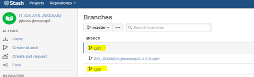

 
**Jenkins Configuration** –

Update the ‘Update Branch Specified’ to point to current branch 

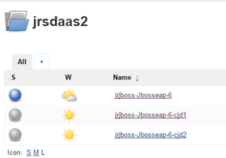

 
Jenkins -> Configuration for Dev : Update Branch Specifier (blank for 'any') - */master
Jenkins -> Configuration for cjd1 : Update Branch Specifier (blank for 'any') - */cjd1
Jenkins -> Configuration for cjd2 : Update Branch Specifier (blank for 'any') - */cjd2

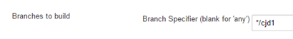

 

**Scenario 2: Multiple Pipelines with Dev, Stg, Dev1(cjd1), Stg1(cjs1), Dev2(cjd2), Stg2(cjs2), Lt & Prod**

### **Step1: Deploy to Dev(Release) Lifecycle**

a)	Add the correct version for dev lifecycle in pom.xml “<version>x.x.x-dev-SNAPSHOT</version> 

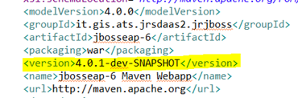

 
b)	Build the Dev branch in Jenkins
Status: Build successful & moved to Artifactory

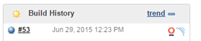

c)	Validate the Snapshot in AR(ext-snapshot-local)
Status: Artifact created jbosseap-6-4.0.1-dev-20150629.192319-1.tar.gz 
 
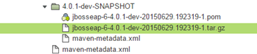

d)	Validate UDeploy
Status: Deployment is successful to Dev
 
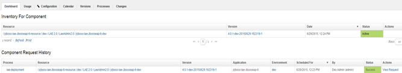

### **Step 2: Deploy to Stg(Release) Lifecycle**

a)	Promote to Release via “Artifactory Release Staging” in Jenkins
Release version: 4.0.1-dev
Jenkins -> Select the dev job (jrjboss-Jbosseap-6) -> Artifactory Release Staging

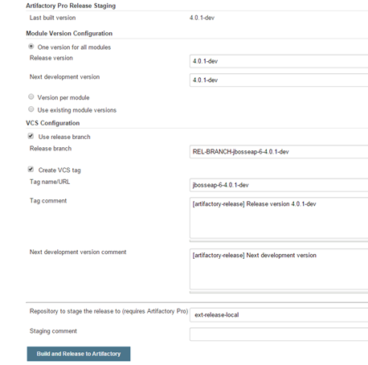

**Status: Build successful & moved to Artifactory**

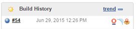

 

b)	Create Snapshot through UDeploy
c)	In Udeploy, under your Application dashboard, choose Snapshots Tab
d)	In Snapshots, click on Create **New** and in next page select release life cycle
e)	From dropdown section you can choose latest artifact, which was built and pushed by executing Jenkins Release Staging.
f)	**Note:** Since Artifactory Release path is same for all primary deployment life cycles; you can view all 3 Jenkins Jobs latest artifacts in the dropdown section. So you can choose artifact in corresponding to your development track.

 
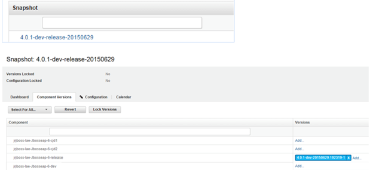

g)	Verify snapshot on URelease

**Status: Snapshot is successfully displayed in URelease.**

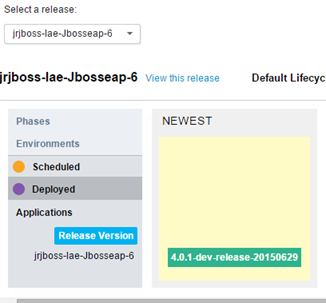

 
h)	Promote to Stg

**Status: Successfully drag-n-drop, Approve, Start.**

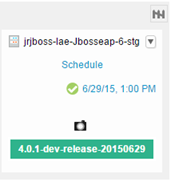

 

### **Step 3: Deploy to Dev1(cjd1-Release) Lifecycle**

a)	Add the correct version for dev lifecycle in pom.xml “<version>x.x.x-cjd1-SNAPSHOT</version> 

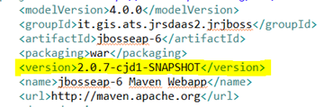

 
b)	Build the Dev branch in Jenkins
**Status: Build successful & moved to Artifactory**

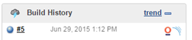

 

c)	Validate the Snapshot in AR(ext-snapshot-local)
**Status: Artifact created jbosseap-6-2.0.7-cjd1-20150629.201240-1.tar.gz**

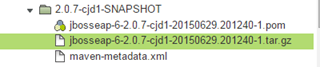

g)	Validate UDeploy
-	Select the primary lifecycle to which the build is deployed

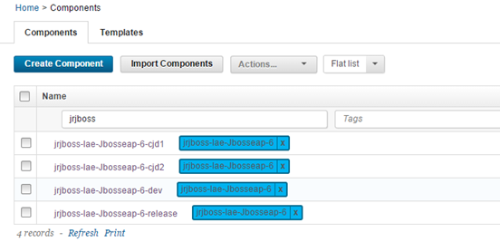

 

-	**Status: Deployment is successful to Dev**

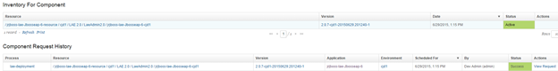

 

### **Step 4: Deploy to Stg1(Release) Lifecycle**

a)	Promote to Release via “Artifactory Release Staging” in Jenkins

b)	**Note:** You can only choose latest version of that primary branch build for Release staging. If you want to choose earlier versions, need to revert code in repository and start from primary life cycle build & deploy. Or you can choose previous snapshot created with that build also can be promoted directly from URelease.

Release version: 2.0.7-cjd1

Jenkins -> Select the cjd1 job (jrjboss-Jbosseap-6-cjd1) -> Artifactory Release Staging

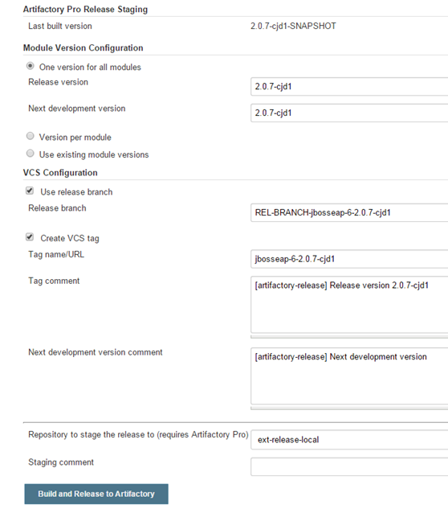

 
**Status: Build successful & moved to Artifactory**

c)	Create Snapshot through UDeploy

d)	In Udeploy, under your Application dashboard, choose Snapshots Tab

e)	In Snapshots, click on Create **New** and in next page select release life cycle

f)	From dropdown section you can choose latest artifact, which was built and pushed by executing Jenkins Release Staging.

g)	**Note:** Since Artifactory Release path is same for all primary deployment life cycles; you can view all 3 Jenkins Jobs latest artifacts in the dropdown section. So you can choose artifact in corresponding to your development track.

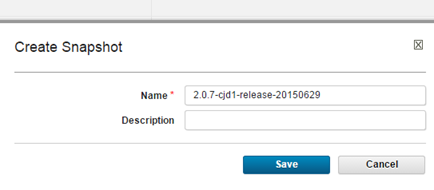

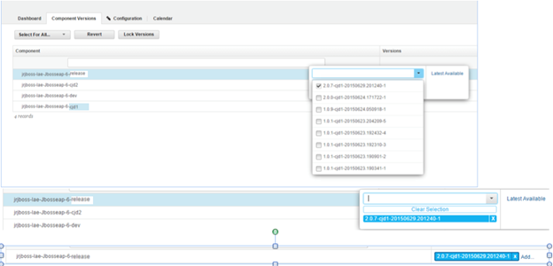

 h)	Verify snapshot on URelease
 
**Status: Snapshot is successfully displayed in URelease.**

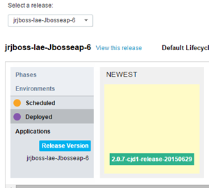

 
i)	Promote to Stg1(cjs1)

**Status: Successfully drag-n-drop, Approve, Start.**

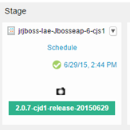

**Step 5: Deploy to Dev2(cjd2-Release) Lifecycle**

a)	Add the correct version for dev lifecycle in pom.xml “<version>x.x.x-cjd2-SNAPSHOT</version> 

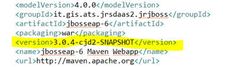

 
b)	Build the Dev branch in Jenkins

**Status: Build successful & moved to Artifactory**

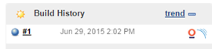

 

c)	Validate the Snapshot in AR(ext-snapshot-local)

**Status: Artifact created jbosseap-6-3.0.4-cjd2-20150629.210211-1.tar.gz**

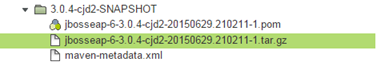

d)	Validate UDeploy

-	Select the primary lifecycle to which the build is deployed

 

-	**Status: Deployment is successful to Dev**

 

### **Step 5: Deploy to Stg2(Release) Lifecycle**

a)	Promote to Release via “Artifactory Release Staging” in Jenkins

Release version: 3.0.4-cjd2

Jenkins -> Select the cjd1 job (jrjboss-Jbosseap-6-cjd1) -> Artifactory Release Staging

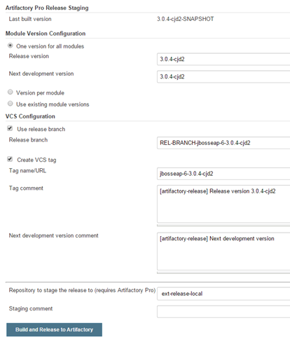

 

**Status: Build successful & moved to Artifactory**

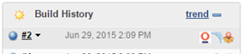

 
b)	Create Snapshot through UDeploy

c)	In Udeploy, under your Application dashboard, choose Snapshots Tab

d)	In Snapshots, click on Create **New** and in next page select release life cycle

e)	From dropdown section you can choose latest artifact, which was built and pushed by executing Jenkins Release Staging.

f)	**Note:** Since Artifactory Release path is same for all primary deployment life cycles; you can view all 3 Jenkins Jobs latest artifacts in the dropdown section. So you can choose artifact in corresponding to your development track.

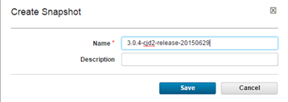

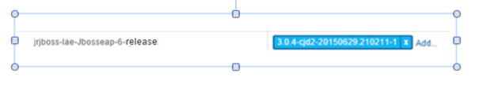

 

 
g)	Verify snapshot on URelease

**Status: Snapshot is successfully displayed in URelease.**

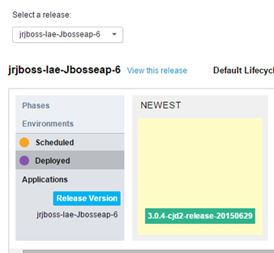

h)	Promote to Stg2(cjs2)

i)	**Note:** Since URelease pipeline is same for all primary deployment life cycles; you can view only latest snapshot created in Newest section, however if you don’t find your snapshot created here (make sure it is created in Udeploy), you can still proceed with scheduling snapshot and later you can choose required version under view execution & deployment plan section. Detailed steps are given below.

**Status: Successfully drag-n-drop, Approve, Start.**
 
++**Scenario 3: Deploy previous snapshot version**++

Step 1: Select the previous snapshot version

a)	Drag and Drop the current snapshot to the lifecycle

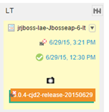

 

b)	Click on the schedule time and pass the gateway
 
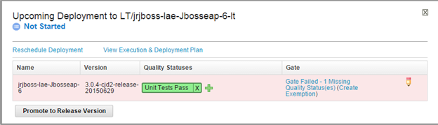

c)	View Execution & Deployment Plan -> Contents & Notifications

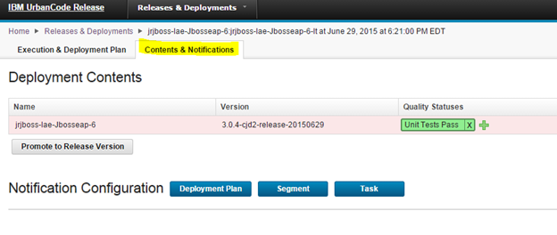

 
d)	Click on the application name (jrjboss-lae-jbosseap-6) -> select the version to deploy
 
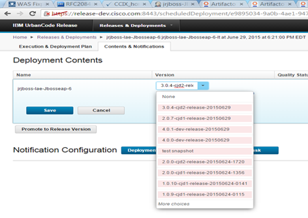

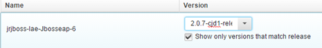

 

e)	Save and Run the deployment manually

